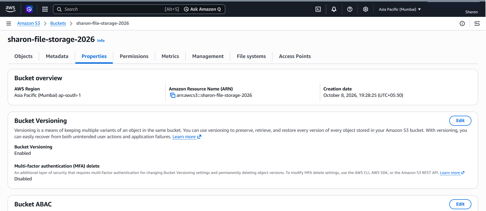
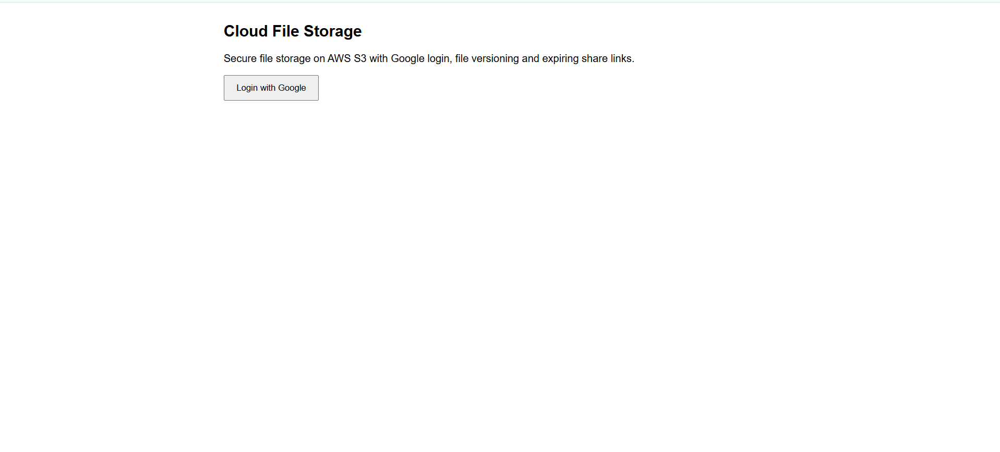
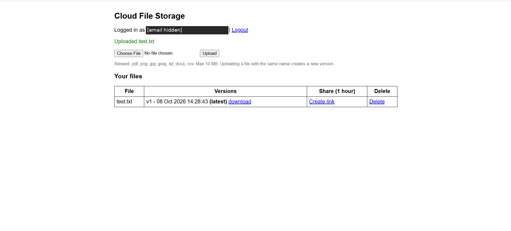
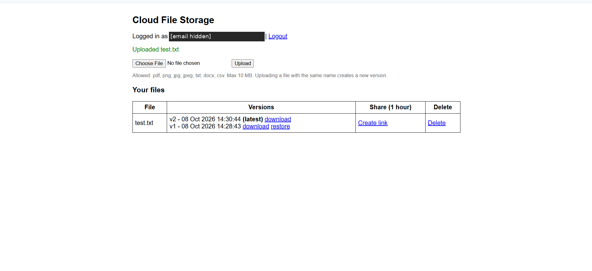
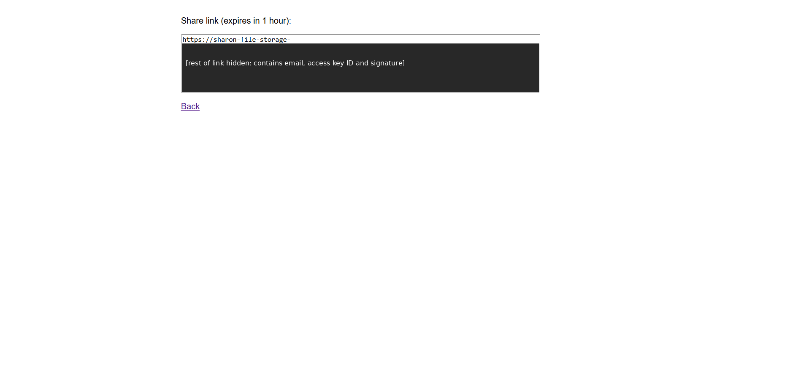
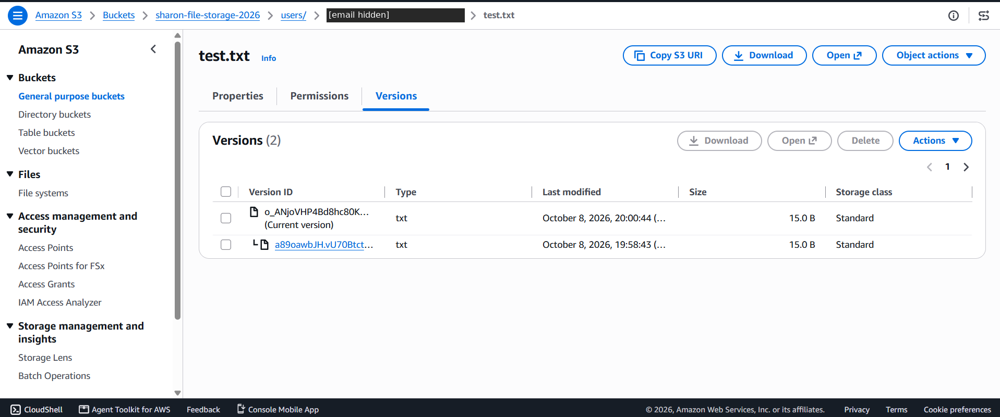

# Cloud-Based File Storage System (AWS S3 + Google OAuth 2.0)

A secure cloud file storage web app, similar to a simple Google Drive. Users sign in with Google (OAuth 2.0 / OpenID Connect), upload files to **AWS S3**, keep **version history**, restore older versions and share files through **expiring links**.

Built as part of my cloud computing internship at Codec Technologies (Project 1: Cloud-Based File Storage System).

## Features

- **Authentication:** Login with Google using OAuth 2.0 (authorization code flow, via Authlib).
- **Cloud storage:** Files are stored in a private AWS S3 bucket in `ap-south-1` (Mumbai).
- **File versioning:** S3 bucket versioning is enabled. Uploading a file with the same name creates a new version; every version is listed with its timestamp.
- **Restore:** Any older version can be restored as the new latest version.
- **Sharing:** Generates a pre-signed URL that expires after 1 hour, so files are shared without making the bucket public.
- **Per-user isolation:** Each user's files live under `users/<email>/` and the server checks ownership on every action.
- **Security:** Block Public Access on, server-side encryption (SSE-S3), file type allow-list, 10 MB size limit, least-privilege IAM policy, no secrets in the repo.

## Architecture

```
Browser --> Flask app (localhost:5000) --> Google OAuth 2.0 (login)
                     |
                     +--> AWS S3 bucket (versioning + encryption, private)
                           users/<email>/<file>   (via boto3, pre-signed URLs)
```

## Tech stack

Python, Flask, Authlib, boto3, AWS S3, AWS IAM, Google Cloud OAuth 2.0

## Setup

1. **S3 bucket:** create a bucket in `ap-south-1`, keep *Block all public access* on, enable *Bucket Versioning* and default encryption (SSE-S3).
2. **IAM user:** create a user with the least-privilege policy in [`iam/s3-policy.json`](iam/s3-policy.json) (replace `YOUR-BUCKET-NAME`) and create an access key.
3. **Google OAuth:** in Google Cloud Console create an OAuth client (Web application) with the redirect URI `http://localhost:5000/auth`.
4. **Configure:** copy `.env.example` to `.env` and fill in the values (never commit `.env`).
5. **Install and run:**
   ```
   python -m venv venv
   venv\Scripts\activate
   pip install -r requirements.txt
   python app.py
   ```
6. Open http://localhost:5000

## Demo

### S3 bucket with versioning enabled


### Google login


### Upload a file


### Multiple versions of the same file


### Expiring share link


### Versions visible in the S3 console


## Security decisions

- The bucket is **private**; files are only reachable through the app or short-lived pre-signed URLs.
- The IAM user can only access this one bucket and only the actions the app needs.
- Authentication is delegated to Google, so the app never stores passwords.
- Every file action checks that the key starts with the logged-in user's own prefix, which blocks access to other users' files.
- Uploads are restricted by file type and size, and filenames are sanitized.
- Credentials are loaded from environment variables; `.env` is in `.gitignore`.

## Possible improvements

- Deploy with AWS Cognito and Lambda/API Gateway instead of a local Flask server.
- User-to-user sharing with permissions stored in DynamoDB.
- KMS customer-managed keys and S3 lifecycle rules for old versions.

## Author

Sharon, B.Tech Information Technology (Cybersecurity)
GitHub: https://github.com/saradel22
